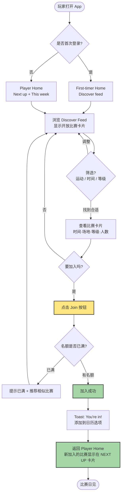
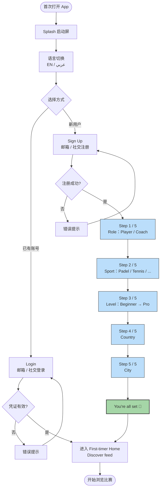
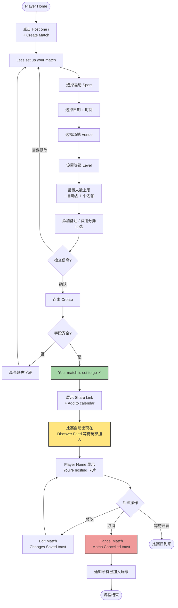
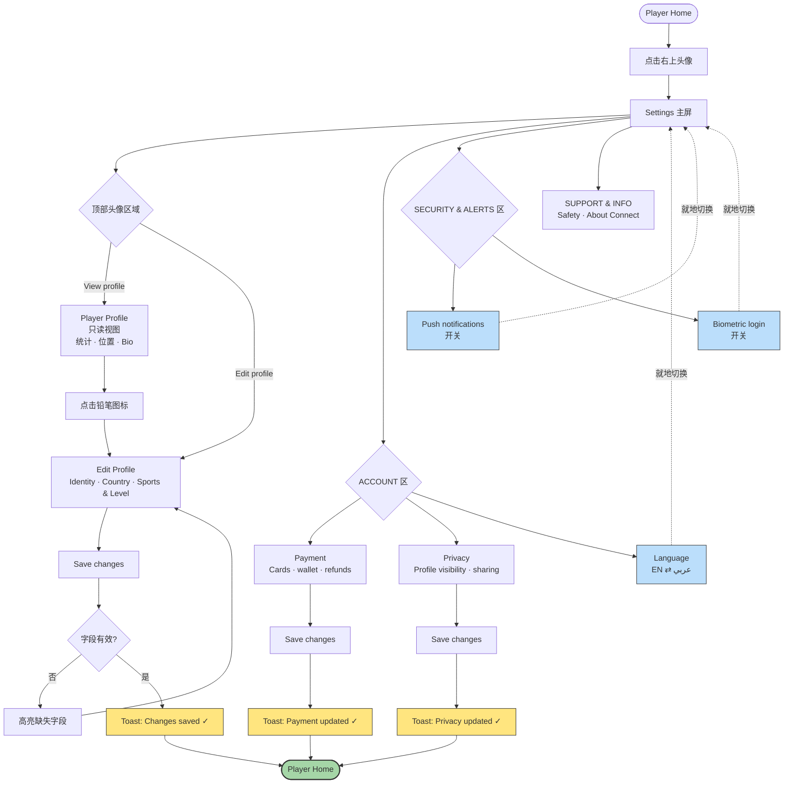
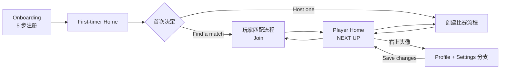

# Connect! — Stage 1 核心流程图

> 基于已确定的 Stage 1 设计决策（pull-based 匹配、Doha 单城、低摩擦优先）
> 更新日期：2026-05-25

---

## 1. 玩家匹配流程（Pull-based Join）

核心理念：玩家自己挑比赛，host 不审核。Discover 卡片上直接 Join，无独立 pre-join detail 页。



**关键设计点：**
- 没有 host 审核环节，Join 即加入
- NEXT UP 卡片就是 post-join 的 match detail 视图
- 满员降级体验：推荐相似比赛，不让用户走死路

---

## 2. 用户注册 / Onboarding 流程

5 步问卷：Role → Sport → Level → Country → City，结尾 "You're all set"。



**关键设计点：**
- 每一步都可返回（progress 指示器）
- City 字段是 Stage 1 的隐性"附近"过滤器，不需要 geolocation
- RTL 适配在每一屏都要预留

---

## 3. 创建比赛流程（Host a Match）



**关键设计点：**
- 创建即开放：无审核环节，发布后立刻进入 Discover
- Host 自动占 1 个名额（默认参赛）
- 取消时主动通知所有已加入玩家——是建立信任的关键

---

## 4. Profile + Settings 分支

核心理念：从 Home 进入个人分支后，**"Save changes" 类提交动作**完成后自动返回 Home（配合 Toast 确认）；**inline 切换**（语言、通知、生物识别开关）就地生效，不导航。
目的：让玩家更新完信息后立刻回到 playing loop，而不是停留在设置层。



**关键设计点：**
- **入口单一：** Home 右上头像 → Settings，不是先经过 Profile。Settings 是分支的根，Profile 是其下的一个视图。
- **提交型 vs 切换型：** Save changes 后必回 Home + Toast（Edit Profile / Payment / Privacy）；inline toggle 永远就地生效（Language / Push / Biometric）。这条规则决定了 1.5 Auth 和后续 build 阶段所有 Edit 表单的导航默认。
- **Toast 必须显眼：** 用户离开了刚编辑的页面，看不到字段变化——所以 Toast 是唯一确认。避免使用低对比度或淡出过快的 toast 样式。
- **View profile 只读：** 编辑入口只有两个——Settings 顶部 "Edit profile" 按钮 和 Profile 右上铅笔图标。不要在只读 Profile 上放可编辑字段。
- **取消路径：** Edit 屏幕的返回箭头 = 放弃编辑，回 Settings（不是回 Home，因为没有 "Save"）。区分"提交回 Home"和"取消回上一级"。

---

## 流程图之间的衔接



---

## 如何修改这些图

把 ` ```mermaid ` 代码块复制到任意 Mermaid 编辑器（如 [mermaid.live](https://mermaid.live)）即可可视化和导出 SVG/PNG。后续要改流程，只需要改 .md 文件里的代码块即可。
